# Отчет по администрированию линукс

## Задание 1

http://ap2-409161.lab-itmo.ru:8080/

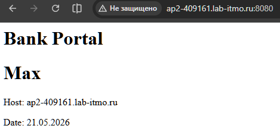

/etc/nginx/sites-available/lab:

```bash
server {
    listen 80;
    server_name ap2-409161.lab-itmo.ru;
    return 301 https://$host$request_uri;
}

server {
    listen 443 ssl;
    server_name ap2-409161.lab-itmo.ru;

    ssl_certificate /etc/nginx/ssl/cert.pem;
    ssl_certificate_key /etc/nginx/ssl/privkey.pem;

    root /var/www/html;
    index lab.html;

    ssi on;

    location / {
        try_files $uri $uri/ =404;
    }
}

server {
    listen 8080;
    server_name ap2-409161.lab-itmo.ru;

    root /var/www/html;
    index lab.html;

    ssi on;

    location / {
        try_files $uri $uri/ =404;
    }
}
```

```bash
ss -tulnp4
```
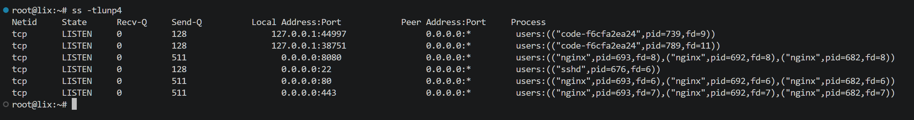


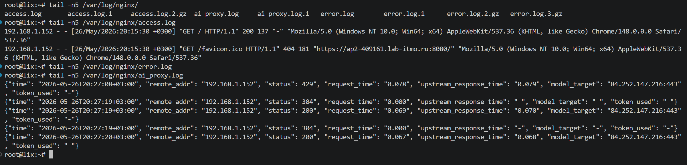

https://ap2-409161.lab-itmo.ru/

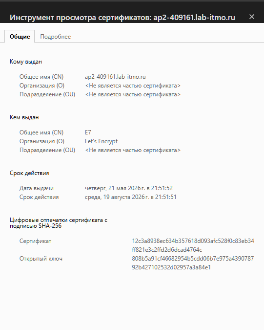

Сертификаты:

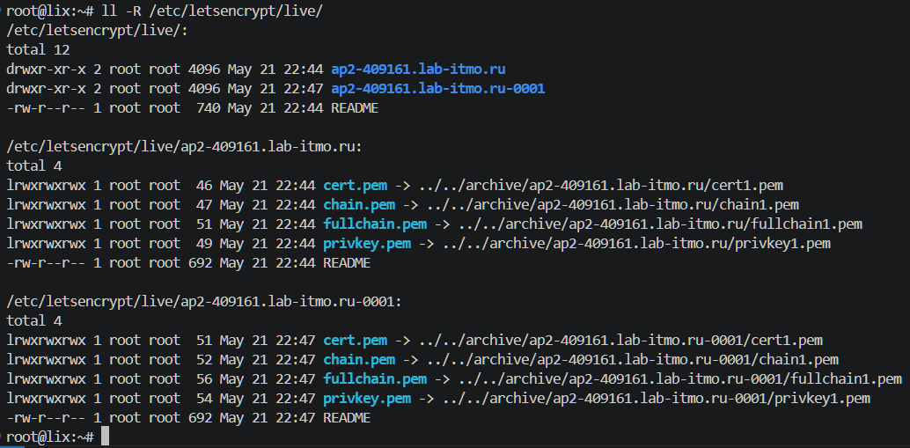


## Задание 2

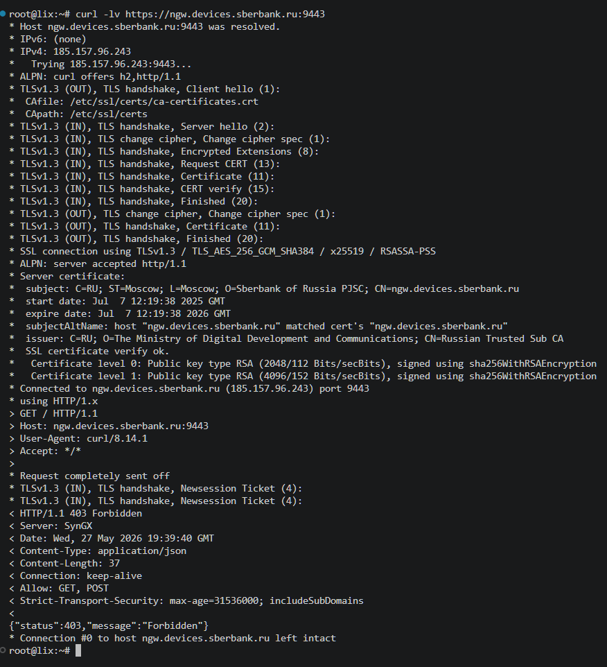

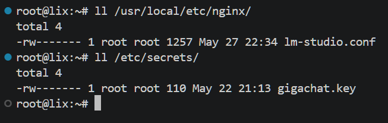

```bash
#!/bin/bash

NGINX_CONF="/usr/local/etc/nginx/lm-studio.conf"
TMP_FILE="/tmp/giga_token.json"
MAX_RETRIES=3

get_token () {
    for ((i=1; i<=MAX_RETRIES; i++)); do
        RQ_ID=$(uuidgen)
        HTTP_CODE=$(curl -s -o $TMP_FILE -w "%{http_code}" -X POST "https://ngw.devices.sberbank.ru:9443/api/v2/oauth" \
            -H "Content-Type: application/x-www-form-urlencoded" \
            -H "Accept: application/json" \
            -H "RqUID: $RQ_ID" \
            -H "Authorization: Basic $AUTH_KEY" \
            -d 'scope=GIGACHAT_API_PERS')

        if [ "$HTTP_CODE" -eq 200 ]; then
            TOKEN=$(jq -r '.access_token' $TMP_FILE)
            rm -f $TMP_FILE

            if [ "$TOKEN" != "null" ]; then
                echo "set \$gigachat_token \"$TOKEN\";" > $NGINX_CONF
                chmod 600 $NGINX_CONF
                systemctl reload nginx
                return 0
            fi
        fi
        echo "Attempt $i: Failed with code $HTTP_CODE. Retrying.." >> /var/log/get-token.log
        sleep 5
    done
    return 1
}

get_token || exit 1
```

```bash
[Unit]
Description=Run gigachat get-token every 20 minutes

[Timer]
OnBootSec=2s
OnUnitActiveSec=20min
Unit=get-token.service

[Install]
WantedBy=timers.target
```

```bash
[Unit]
Description=Update gigachat token
After=network-online.target
Wants=network-online.target

[Service]
Type=oneshot
EnvironmentFile=/etc/secrets/gigachat.key
ExecStart=/usr/local/bin/get_token.sh
Restart=on-failure
RestartSec=60s
StartLimitIntervalSec=0

[Install]
WantedBy=multi-user.target
```

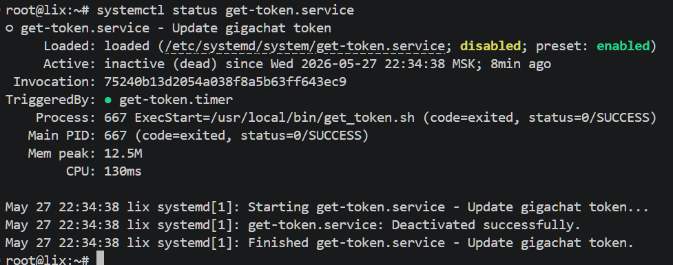

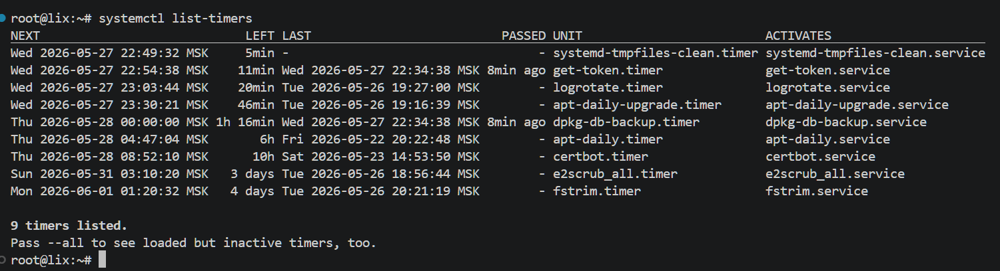

```bash
limit_req_zone $binary_remote_addr zone=balance_limit:10m rate=10r/s;

log_format ai_log_json '{'
  '"time": "$time_iso8601", '
  '"remote_addr": "$remote_addr", '
  '"status": $status", '
  '"request_time": "$request_time", '
  '"upstream_response_time": "$upstream_response_time", '
  '"model_target": "$upstream_addr", '
  '"token_used": "$upstream_http_x_request_tokens"'
'}';

server {
    listen 80;
    server_name ap2-409161.lab-itmo.ru;
    return 301 https://$host$request_uri;
}

server {
    listen 443 ssl;
    server_name ap2-409161.lab-itmo.ru;

    ssl_certificate /etc/nginx/ssl/cert.pem;
    ssl_certificate_key /etc/nginx/ssl/privkey.pem;

    include /usr/local/etc/nginx/lm-studio.conf;

    access_log /var/log/nginx/ai_proxy.log ai_log_json;

    proxy_connect_timeout 60s;
    proxy_read_timeout 600s;

    root /var/www/html;
    index model.html;

    location /api/models {
        limit_req zone=balance_limit burst=5 nodelay;
        proxy_pass https://gigachat.devices.sberbank.ru/api/v1/models;
        proxy_set_header Authorization "Bearer $gigachat_token";
        proxy_ssl_server_name on;
    }

    location /api/chat {
        proxy_pass https://gigachat.devices.sberbank.ru/api/v1/chat/completions;
        proxy_set_header Authorization "Bearer $gigachat_token";

        proxy_buffering off;
        proxy_cache off;
        proxy_set_header Connection keep-alive;
        proxy_ssl_server_name on;
    }

    location /api/balance {
        limit_req zone=balance_limit burst=10 nodelay;

        proxy_pass https://gigachat.devices.sberbank.ru/api/v1/balance;
        proxy_set_header Authorization "Bearer $gigachat_token";
        proxy_ssl_server_name on;
        proxy_next_upstream off;
    }
}

server {
    listen 8080 ssl;
    server_name ap2-409161.lab-itmo.ru;

    ssl_certificate /etc/nginx/ssl/cert.pem;
    ssl_certificate_key /etc/nginx/ssl/privkey.pem;

    root /var/www/html;
    index lab.html;

    ssi on;

    location / {
        try_files $uri $uri/ =404;
    }
}
```

### [model.html](model.html)

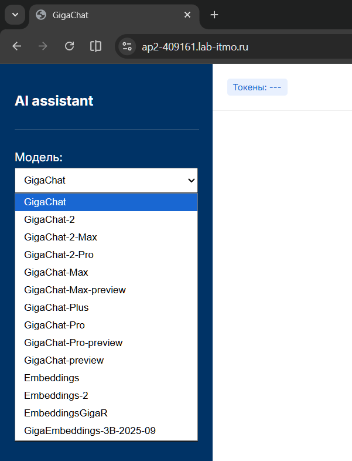

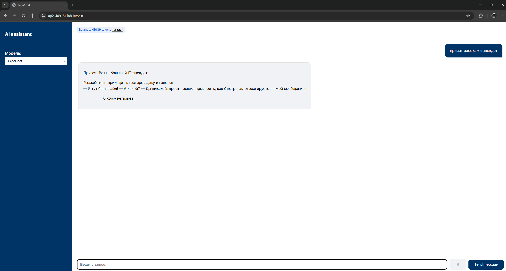

# Вывод

Лабораторная работа получилась полезной, я закрепил знания по сертификатам, научился выпускать их по dns, узнал новые для себя фичи nginx - лимиты и форматирование логов

## спасибо
